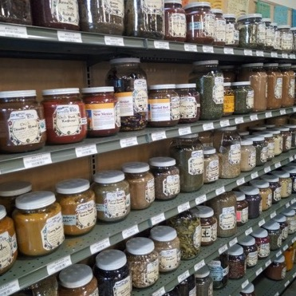
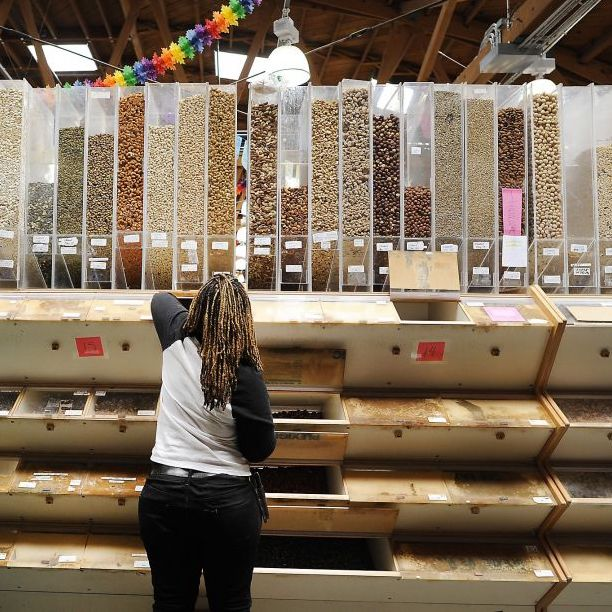
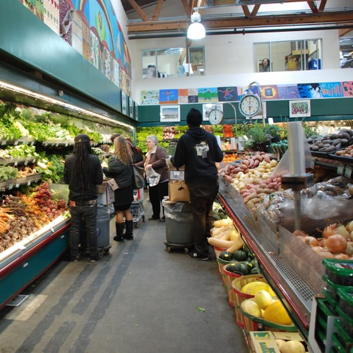
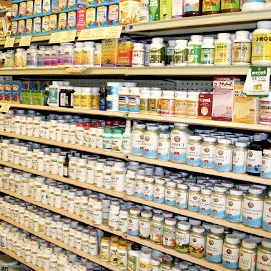
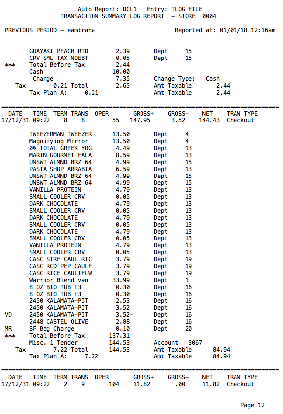
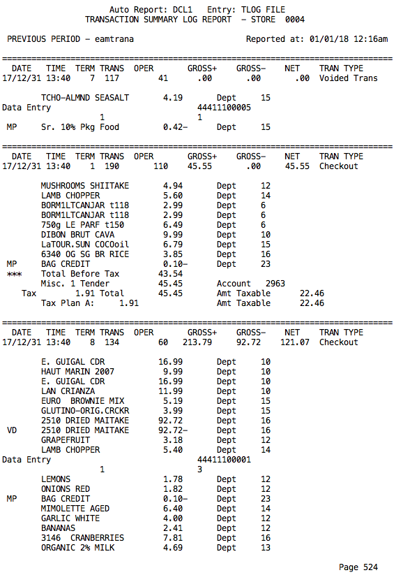
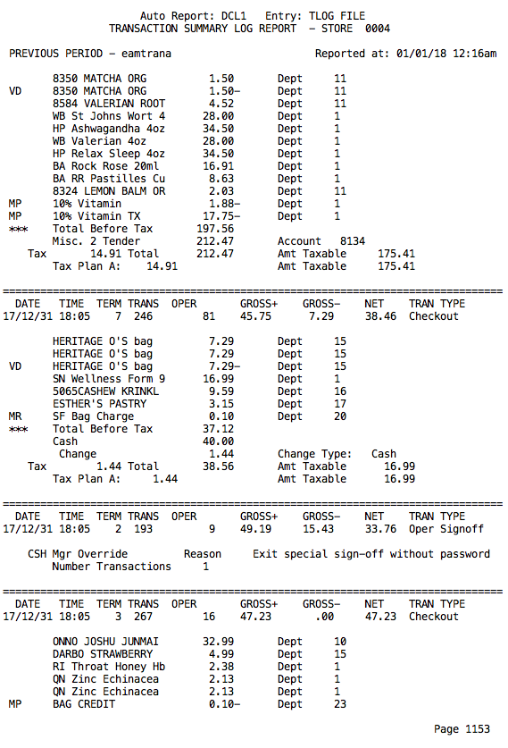

# Reverse Engineering Shopping Lists 
# The Problem: How can a grocery store analyze their customer's shopping without a loyalty program?

A large Bay-Area Natural Food store doesn’t have a method to analyze their customer's baskets.
They have been a fixture of San Francisco since 1975 and have a register system designed in the 80's.

* $1,000,000 in sale per week
* 25,000 square foot
* maintains a selection of 30,000 items
* 2000-3000 customer per day
* no loyalty program 

## Discovering customer types from transactions without a loyalty program!

Everyday the register spits out a giant raw text file (2000 printable pages) of the previous day's 2000-3000 transactions.

Is there a way to find some patterns of shopping in this run-on stream of text?

## Hello Non-Negative Matrix Factorization!

[NMF](https://en.wikipedia.org/wiki/Non-negative_matrix_factorization) is an unsupervised learning model that can be used to find topic similiarity between documents based on the words they contain. Treating each transaction as a document and each item's **unique 13 character description** as a word I will discover the latent dimensions of shopping baskets hidden in this history of purchases.
 
## Step 1. Parse the Data

Using a regex file I found on the web, i modified it to parse the transactionlog.txt ('tlogs') into useable elements. Date, time, total, cashier, lane, items, price and department code were all waiting to be pulled from a consistently formated text file.  I also had to account for stray punctuation characters in the item descriptions.
Writing the results into a json format allowed for them to be quickly read into a pandas dataframe.

## Step 2. Prepare the Item List and Dictionary

The item data was extracted as a list of list which I iterated through, adding the item to a dictionary with a running count of the items, ultimately yielding a dictionary of all the items in the all the baskets, and their total count.  I developed a "stop words" list to remove common items which made basket similarites worse. Bag Credits and bottle deposits were linking too many baskets because they were present in many baskets but were not actual items that lend any insight into shopping habits.  
Bananas were in 112832 of the 831284 baskets, roughly 1 in 8 baskets, or 13.5% of transactions and Hass Avocados were in 10% of baskets.
Removing both of these items allowed a greater differentiation between baskets.

## Step 3. Builing a Sparse Matrix

Because I needed the items descriptions to remain entact at the entire 13-character string, I built my own vectorizer. Each time an item was present in the basket, I added 1. If the value was negative (such as a voided item) I subtracted 1. This accounted for an item being rung up twice and voided once, for example. Iterating through the lists of transactions and adding a dicitonary key for the row (transaction) and a tuple of the item and its count in the basket I built up a dictionary object which was then passed to a sparse matrix.

## Step 4. Pass the Matrix to the NMF Model

Just before passing the sparse matrix to the NMF model, I set any negative values to 0. After choosing a value for the number of components (topics) and maximum iterations I let the NMF work its magic.  I returned from the model the number of iterations the model used to achieve the number of components specified, and the decomposed matrices W(rows of transactions, columns of topics) and H (rows of topics, columns of items).

## Step 5. Interpretting the model.

The values in W and H represent that item or transactions assocation or weight to that topic. The higher the number, the more weight that item or transaction contributes to that topic. Sorting these in descending order shows up the most related items and transactions for each topic.

## Step 6. What is the best number of topics?

To evaluate or score a topic modeler, we can compare the dot product of the resulting matrices W and H against the original matrix and evaluate the differences. With this specific type of data, increasing topics continued to slowly score better and better but the actual results of the increase topics were not an improvement, they got worse. By 10 topics, the top items were so blended between different topics that they were not easily differentiable. I settled on 7 topics for this data set and I encourage you to evalute the number of components with math and your eye.

## Step 7. Interperting the results.

Well it turned out I was not finding the customer types as I set out to, but I did discover these shopping dimensions, these grocery vectors that baskets can align along. When people go shopping, it is often with a specific, similar and repeated purpose. People shop for ingredients to make: soup, salsa and salad.

## Two Topics: People Who Cook and People Who Don't.

When I set the model to only sort into two topics, I found:

| 0.69               | 0.31               |
|:-------------------|:-------------------|
| ONIONS YELLOW      | APPLES FUJI        |
| GARLIC WHITE       | 1lb STRAWBERRY     |
| PEPPERS RED BELL   | ORANGES NAVEL      |
| LEMONS             | BROCCOLI LOOSE     |
| CELERY             | CARROTS BUNCH      |
| ONIONS RED         | BAGEL              |
| CARROTS LOOSE      | TOMATO DRY FARM    |
| GINGER             | CUCUMBERS          |
| SQUASH ZUCCHINI    | KALE DINO          |
| CILANTRO           | SPINACH LOOSE      |
| LIMES              | PEAR BARTLETT      |
| KALE DINO          | BEANS GREEN        |
| PEPPER CHILI       | 5290 WALNUTS       |
| MUSHROOM CRIMINI   | NECTARINE          |
| ONIONS GREEN       | ORANGES VALENCIA   |
| CUCUMBERS          | SATSUMA MANDARIN   |
| CARROTS BUNCH      | LETTUCE SALAD MIX  |
| PARSLEY ITALIAN    | REFRIGERATED       |
| BROCCOLI LOOSE     | ARUGULA LOOSE      |
| BEANS GREEN        | PEACH              |
| SPINACH LOOSE      | GRAPES RED         |
| POTATOES GARNET    | CARROTS LOOSE      |
| POTATOES YELLOW    | CUKE MEDIT/PERSIAN |
| LETTUCE SALAD MIX  | GRAPEFRUIT         |
| ARUGULA LOOSE      | PEAR BOSC          |
| CUKE MEDIT/PERSIAN | POTATOES GARNET    |
| TOMATO DRY FARM    | PLUOT/PLUM RED     |
| HERBS BUNCH        | BLUEBERRY          |
| SHALLOTS           | 3185 ORG MANGO     |
| 1lb STRAWBERRY     | BROCCOLI  BUNCHED  |
| TOMATOES ROMA      | KIWI LOOSE         |
| 5290 WALNUTS       | 5120 ORG ALMONDS   |
| TOMATO MIX HEIRLOO | SQUASH ZUCCHINI    |
| LEEKS              | PERSIMMONS FUYU    |
| MUSHROOMS SHIITAKE | POTATOES JAPANESE  |
| CAULIFLOWER BULK   | PEPPERS RED BELL   |
| PEPPERS GREEN BELL | PEARS RED          |
| ORANGES NAVEL      | TOMATO MIX HEIRLOO |
| CABBAGE RED        | CORN               |
| POTATOES RUSSET    | MANGO              |
| CORN               | CELERY             |
| EGGPLANT GLOBE     | BEETS RED LOOSE    |
| BROCCOLI  BUNCHED  | CAULIFLOWER BULK   |
| APPLES GALA        | 2448 CASTEL OLIVE  |
| PEACH              | BROCCOLI BABY SWEE |
| BROCCOLI BABY SWEE | LETTUCE RED BUTTER |
| BEETS RED LOOSE    | SUGAR PLUM CLAM    |
| NECTARINE          | LETTUCE RED LEAF   |
| POTATOES JAPANESE  | CARROTS BABY       |
| KALE GREEN         | APPLES, GRANNY SMI |
